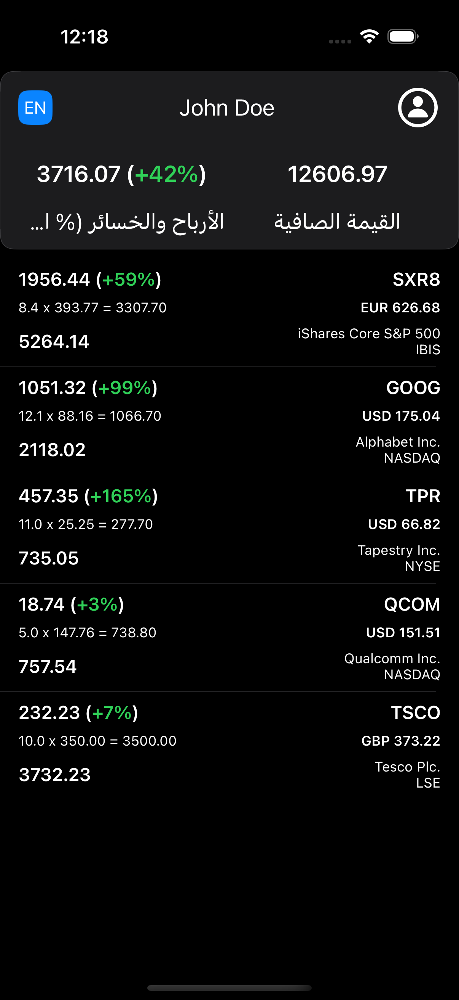

# baraka-iOS

A sample portfolio viewer built with UIKit, RxSwift and the MVVM pattern. The app downloads a portfolio from `https://dummyjson.com/c/60b7-70a6-4ee3-bae8`, displays the balance and open positions and simulates live market prices.

## Features
- Fetch portfolio details from the remote JSON endpoint.
- Display net value, profit/loss and individual positions.
- Simulated real‑time price updates using RxSwift.
- English and Arabic localisation with automatic layout direction.
- Unit tests covering formatting helpers and network requests.
- Centralized theme for fonts and colors.

## Project Summary Table

- Platform	iOS (UIKit)
- Minimum iOS Version	13.0
- Architecture	MVVM + RxSwift
- Layout System	Programmatic UI using UICollectionViewCompositionalLayout and UITableView
- Reactive Framework	RxSwift
- Live Market Simulation	Simulates live price updates using Observable.interval
- Data Source	Dummy JSON
- Unit Tests	XCTest (basic coverage included)
- Language Support	English / Arabic with RTL alignment
- Localization Toggle	Toggle button with UISemanticContentAttribute updates


## APP Screenshots

| Light Mode              | Dark Mode               |
|------------------------|-------------------------|
|  |  |
|  |  |


## Project Structure


## Requirements
- Xcode 15 or later
- CocoaPods
- iOS 13+

## Installation
1. Clone the repository.
2. Run `pod install` to fetch dependencies.
3. Open `baraka-iOS.xcworkspace` and run the **baraka-iOS** scheme.

### Building from the command line
```bash
xcodebuild -workspace baraka-iOS.xcworkspace \
  -scheme "baraka-iOS" \
  -sdk iphonesimulator \
  -destination 'platform=iOS Simulator,name=iPhone 16 Pro Max,OS=18.0' \
  CODE_SIGNING_ALLOWED=NO \
  CODE_SIGNING_REQUIRED=NO \
  build
```

### Tests


## Theme
Fonts and colors are defined in `Theme.swift` and used throughout the app for a consistent look and feel.

## Screenshots

## License
baraka-iOS is available under the MIT license.
